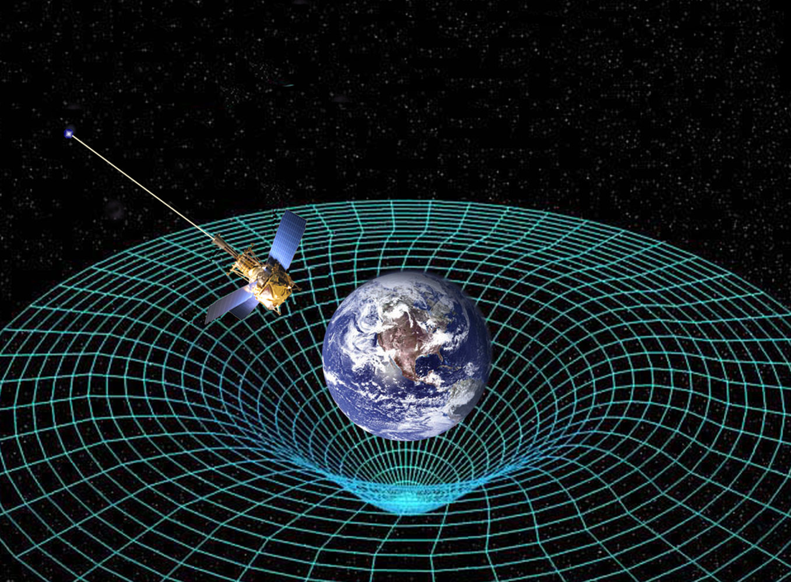

##  ¿Qué es la teoría de la relatividad?
La teoría de la relatividad es un campo de la física que trata de explicar todos los fenómenos físicos independientemente de su situación (escala, posición, etc..). Para ello tiene en cuenta situaciones en donde la gravedad está presente o está (prácticamente) ausente.

Puede parecerte un poco contradictorio decir que trata de una teoría que trata de explicar todo y al mismo tiempo se tenga que dividir en dos, pero tiene una explicación. Y no es otra que la influencia de la gravedad, que afecta a nuestra realidad enormemente.

De esta forma, la única manera que conocemos de dar una explicación completa a la física de nuestro universo es usando dos teorías independientes:

##### ¿Qué es la teoría de la relatividad?

Definición de la teoría de la relatividad y explicación de sus dos sub-teorías: Relatividad general y relatividad especial

#### 1. La teoría general de la relatividad

Explica como se relaciona la gravedad con el resto de factores físicos de la realidad. 

Específicamente, formula, que la gravedad es una propiedad geométrica del tiempo y del espacio. O lo que es lo mismo, cuanta más energía y materia exista en un punto, mayor será la gravedad, y por lo tanto, mayor deformación geométrica existirá (curvatura del espacio-tiempo).

Eso sí, no tienes que tomarte esta afirmación al pie de la letra. La realidad es que las ecuaciones de la relatividad general poseen soluciones exactas para ciertas situaciones (siendo muy útiles), pero son incapaces de dar respuesta certeras en otras situaciones. 

#### 2. La teoría especial de la relatividad 

Explica cómo se relacionan el espacio y el tiempo cuando la fuerza de la gravedad es despreciable.

De esta forma, la afirmación principal de esta teoría es que todas las leyes físicas son iguales en cualquier punto del espacio. Pero esto solo ocurre cuando no existe aceleración, es decir, que no exista gravedad u otra fuerza externa que modifiqué las leyes de tu sistema de referencia. 

Esta teoría consigue explicar también los movimientos a altas velocidades (cercanos a los de la luz).

En resumen, la teoría de la relatividad es una ampliación de las teorías de la mecánica newtoniana. Da explicación a dos situaciones que no podían entenderse con la mecánica clásica; la influencia de la gravedad masiva y la forma en la que cualquier sistema físico funciona en cualquier escala espacial y temporal.

-- Referencias
PROCEST - Web especializada en el concepto de proceso y sus tipos. (2020, 13 septiembre). PROCEST. https://www.xn--procesosestratgicos-ozb.com

